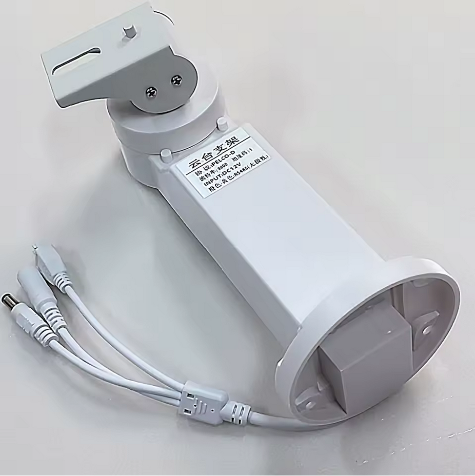
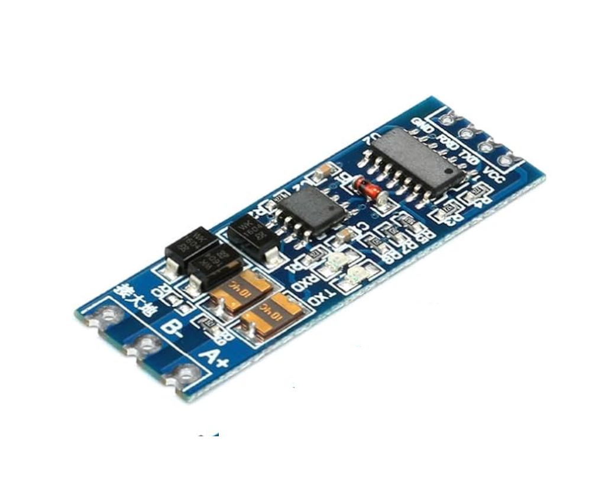

# Visca2Pelco
ESP32/MicroPython code for controlling a Pan-Tilt bracket

This code implements a translator for using the [SONY VISCA over IP protocol](https://www.sony.net/Products/CameraSystem/CA/BRC_X1000_BRC_H800/Technical_Document/C456100121.pdf) to control a PELCO-D Pan-Tilt bracket, such as one [this one from AliExpress](https://www.aliexpress.us/item/3256806846839809.html)

The code provides a minimal Visca implementation for the functions supported by the bracket
- Camera movement, PAN / Tilt, commands are implemented
- Zoom and Focus change are not implemented
- "Home" is implemented, but not programable presets
- There are stub implementations of VISCA INQUIRY commands, enough to provide compatibility with an [AVKANS IP Joystick controller](https://avkans.com/products/avkans-super-ptz-camera-joystick-controller-ndi-camera-controller-keyboard-with-4d-joystick-for-live-streaming-onvif-visca-over-ip-rs422-rs485-rs232-pelco-d-p-support). It has not been tested with other joystick controllers

The code assumes an external RS485 adaptor module, [such as this one](https://www.amazon.com/dp/B0BXDJHFSP), by default connected to IO17 on the ESP32.

